# Cafeteriabot Project

The final goal of the project is to set up an automatic system that allows for a trash table in cafeteria to be found and picked up by a robot called `cleaner` and taken to a back room, where it will be emptied.

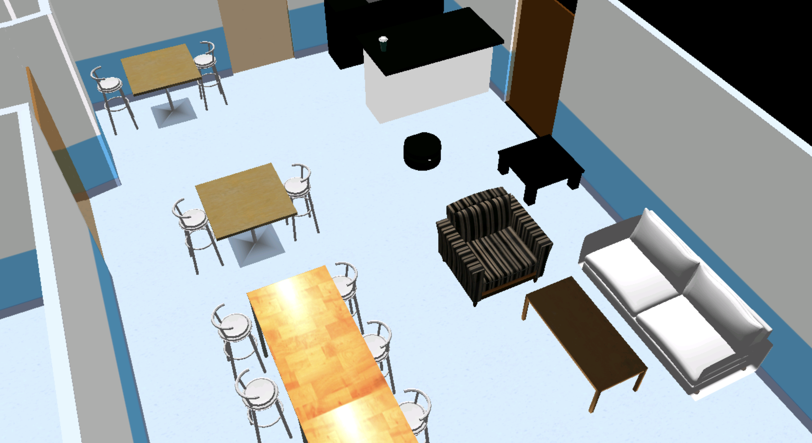

  

## Structure

```text
.
├── cafeteriabot_firmware
│   ├── cafeteriabot_firmware
│   │   ├── __init__.py
│   │   ├── cafeteriabot_control.py
│   │   ├── cluster_algorithm_analysis.py
│   │   ├── elevator_management.py
│   │   ├── filter_algorithm_analysis.py
│   │   ├── laser_scan_clustering.py
│   │   ├── laser_scan_detection.py
│   │   ├── laser_scan_filtering.py
│   │   ├── pid_control_visualizer.py
│   │   ├── point_marker_analysis.py
│   │   ├── pose_marker_analysis.py
│   │   └── table_docking_service.py
│   ├── config
│   │   └── waypoints.yaml
│   ├── launch
│   │   ├── algorithm_analysis.launch.py
│   │   ├── cafeteriabot_control.launch.py
│   │   └── detection_server.launch.py
│   ├── resource
│   ├── test
│   ├── package.xml
│   ├── setup.cfg
│   └── setup.py
├── cafeteriabot_interface
├── cafeteriabot_navigation
│   ├── config
│   │   ├── real
│   │   ├── sim
│   │   └── behavior_tree.xml
│   ├── frames
│   ├── launch
│   │   ├── cartographer_slam.launch.py
│   │   ├── localization_server.launch.py
│   │   ├── map_server.launch.py
│   │   └── navigation_server.launch.py
│   ├── maps
│   ├── rviz
│   ├── CMakeLists.txt
│   └── package.xml
├── Dockerfile
├── README.md
├── docker-compose.yml
└── ros_entrypoint.s
```

## Setup

#### Distribution

Use docker for quick-start (for both ROS1 or ROS2):

```bash
# using docker for ROS1
$ docker run -ti --rm --name local-ros-noetic ros:noetic
```

```bash
# using docker for ROS2
$ docker run -ti --rm --name local-ros-humble ros:humble
```

#### Build (Package)

Now, create a catkin workspace, clone the package:

```bash
# setup directory
$ mkdir ~/ros2_ws/src/
$ git clone <repo_name> ~/ros2_ws/src/
```

Install the required packages (dependency) mentioned in `package.xml` using `apt`:

```bash
# check if package is available
$ ros2 pkg list
$ ros2 node list
```

```bash
# update path to installed packages
$ source /opt/ros/humble/setup.bash
```

To build locally or inside docker use the following commands:

```bash
# execute build
$ cd ~/ros2_ws && colcon build
$ source ~/ros2_ws/install/setup.bash
```

## Robot

The robot used in real lab is `TurtleBot4`, it is a small, affordable, programmable, ROS-based mobile robot for use in education, research, hobby, and product prototyping.

#### Links

- `cleaner_2/base_link` (located at the center of the rotation axis that connect the two wheels)
- `cleaner_2/laser_sensor_link` (location of laser sensor)

#### TF-Tree

TF tree for some important frames in robot model.

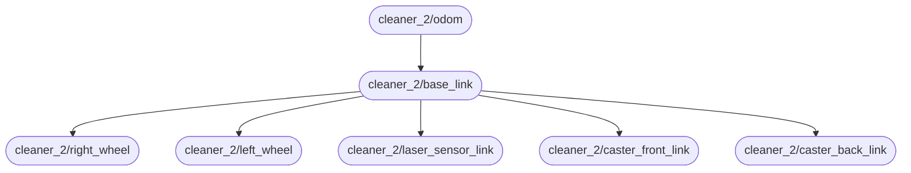

## Launch

The project is divided into three core components and contains multiple launch files to start a complete or partial system based on requirements.

- `Navigation` : It is configured using Nav2 stack and is responsible for enabling autonomous robot navigation and control.
- `Detection` : Manages the detection and localization of the table on the map, represented in red.
- `Control` : Can perform tasks (like, patrol, dock, undock, move) based on high-level control, represented in green.

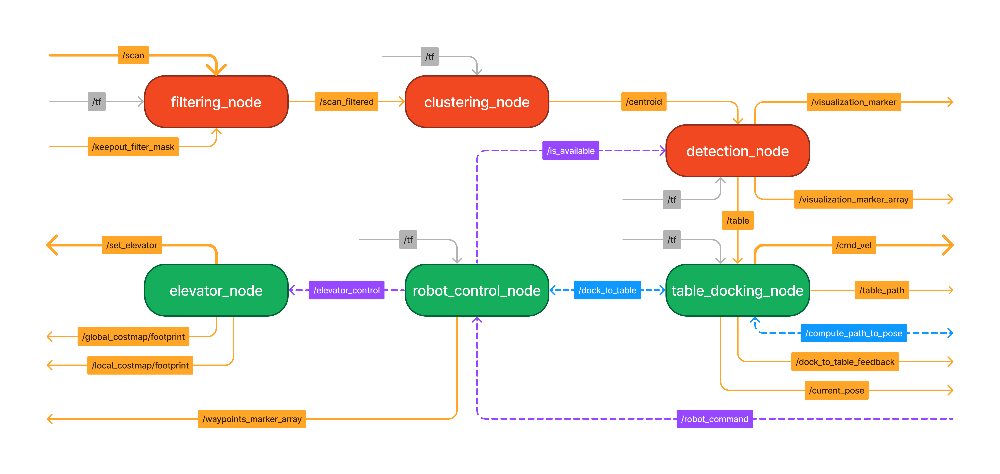

**Note:** Use launch argument `use_sim_time:=False` to execute in real lab, for any launch file or node.

#### Navigation Server

The ROS2 navigation stack is a comprehensive system designed for autonomous robot navigation, providing tools for path planning, localization, and obstacle avoidance.

```bash
# launch complete navigation stack
$ ros2 launch cafeteriabot_navigation navigation_server.launch.py
```


```bash
# launch only localization server
$ ros2 launch cafeteriabot_navigation localization_server.launch.py map_file:=cafeteria_map_mask_sim.yaml
```

```bash
# launch only map server
$ ros2 launch cafeteriabot_navigation map_server.launch.py map_file:=cafeteria_map_sim.yaml
```

##### Navigation2

The separate folder for simulation and real environment, containing files for navigation configuration.

- `behavior_server.config.yml` : Configures parameters for the behavior server managing complex navigation behaviors.
- `behavior_tree.config.yml` : Defines parameters for behavior trees used in navigation decision-making.
- `controller_server.config.yml` : Contains settings for the controller (local planner) responsible for executing planned paths.
- `filter_mask.config.yml` : Specifies configurations for the filter mask used in obstacle avoidance.
- `localization_server.config.yml` : Configures the localization server for robot position estimation on map.
- `planner_server.config.yml` : Defines parameters for the planner (global panner) handling path planning.

##### Cartographer

To create map of the environment launch `cartographer_slam.launch.py` from `cafeteriabot_navigation` package.

- `cartographer.config.lua`: Sets up configuration for the Cartographer SLAM algorithm for mapping and localization.

```bash
# launch cartographer and slam
$ ros2 launch cafeteriabot_navigation cartographer_slam.launch.py
```

#### Detection Server

The detection system identifies tables in the surrounding environment using laser filtering, clustering, and polygon detection, and publishes their locations relative to the `map` frame.

The `detection_server.launch.py` launch file contains the followings nodes:

- `laser_scan_filtering` : Processes and filters laser scan data to reduce noise and enhance scan data.
- `laser_scan_clustering` : Groups filtered laser scan data into clusters representing potential objects.
- `laser_scan_detection` : Detects specific objects, such as tables, within the clustered data and determines their locations.

```bash
# launch complete detection server
$ ros2 launch cafeteriabot_firmware detection_server.launch.py
```

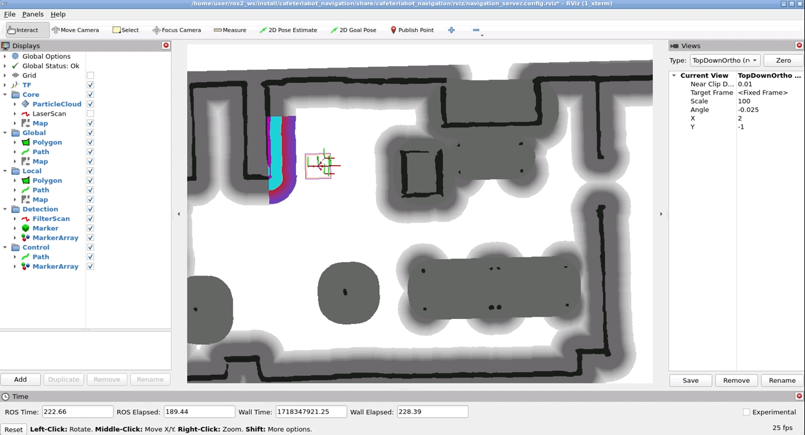

The detection server identifies tables by processing laser scan data through a series of steps. First, `laser_scan_filtering` reduces noise with the help of map data. Then, `laser_scan_clustering` groups the filtered data into clusters representing potential objects. Finally, `laser_scan_detection` analyzes these clusters to detect and locate tables accurately.

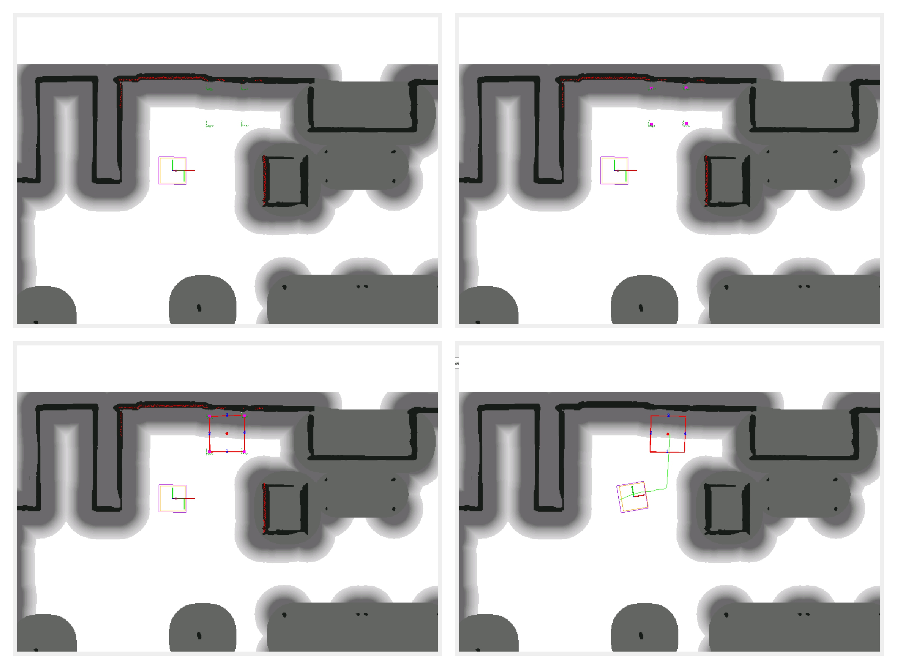

ROS2 node `laser_scan_detection` publish table position on `/table` topic, check node graph for more details.

```bash
# to view the laser scan
$ ros2 topic echo /table
```

#### Cafeteriabot Control

The Cafeteriabot contol a.k.a. `control server` are high level control nodes which governs movement and operations of the CafeteriaBot using `nav2_simple_commander` api and `state machine`.

The `cafeteriabot_control.launch.py` launch file contains the followings nodes:

- `table_docking_service` : Is an action server and manages the robot's docking operations to tables once requested.
- `elevator_management` : Manages the robot's interaction with elevators and also update robot footprint.
- `cafeteriabot_control` : Oversees the overall high level control, movement and operations of the CafeteriaBot.

```bash
# launch complete control server
$ ros2 launch cafeteriabot_firmware cafeteriabot_control.launch.py
```

To request different behavior, send service call on `/robot_command` for valid command like `patrol`, `home_to_drop`, `drop_to_home`, `dock`, and `stop` as show below.

```bash
# request state transaction
$ ros2 service call /robot_command cafeteriabot_interface/srv/RobotCommand "{command: 'patrol'}"
$ ros2 service call /robot_command cafeteriabot_interface/srv/RobotCommand "{command: 'stop'}"
```


The `cafeteriabot_control` node works on a **state machine**, based on automata, and transitions through states such as `IDEAL`, `PATROL`, `DOCK`, `MOVE`, `UNDOCK`, and `HALT` to manage the robot's actions and behaviors.

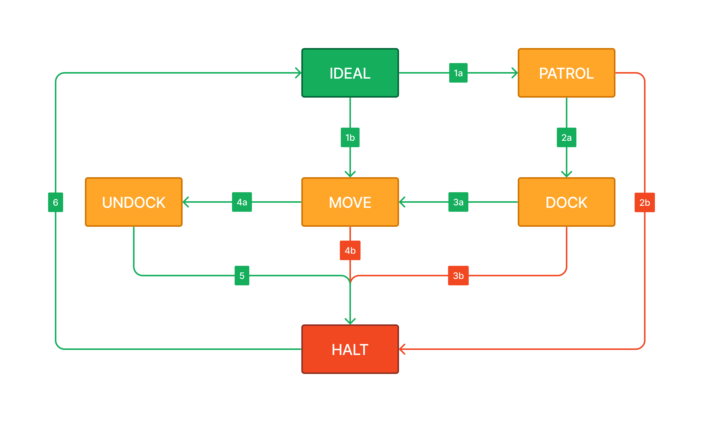

| State  | State Description                                                              |
| :----: | ------------------------------------------------------------------------------ |
| IDEAL  | The robot is in a standby mode, awaiting further instructions.                 |
| PATROL | The robot navigates a predefined route for monitoring while looking for table. |
|  DOCK  | The robot finds the table, aligns and then performs dock.                      |
|  MOVE  | The robot travels from one position to another (i.e. from `home` to `drop`).   |
| UNDOCK | The robot undock and moves out of the table.                                   |
|  HALT  | The robot stops all/any movement and operations temporarily.                   |

**Note:** Above diagram represents the state machine and valid state transaction, green represents success/intended and red represents failed/error transaction.

#### Algorithm Analysis

The algorithm analysis helps to fine-tune algorithms and evaluates pre-deployment performance, ensuring the CafeteriaBot operates efficiently and effectively in dynamic environments.

The `algorithm_analysis.launch.py` launch file contains the following nodes:

- `point_marker_analysis` : Classify the point published on `/clicked_point` as `free` or `occupied` marker in rviz.
- `pose_marker_analysis` : Publish marker of the position and orientation of robot from `odom`, `amcl` and `tf` in rviz.
- `filter_algorithm_analysis` : Classify all the laser scan point as `free` or `occupied` marker in rviz.
- `clustering_analysis_node` : Identify and plot cluster centroid on map as marker in rviz.

```bash
# launch algorithm analysis
$ ros2 launch cafeteriabot_firmware algorithm_analysis.launch.py
```

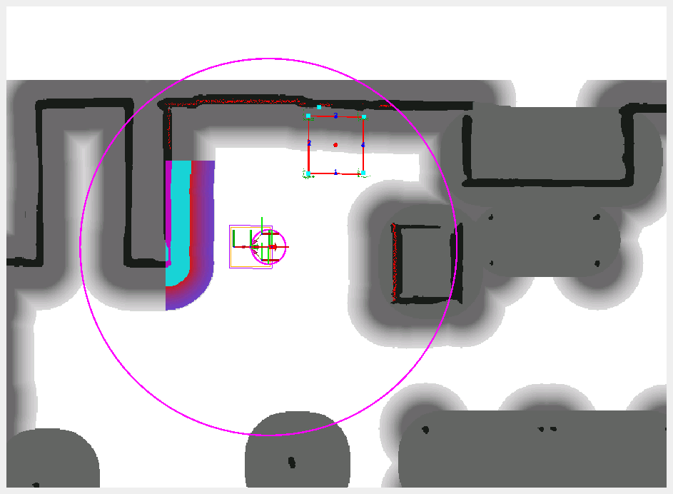

```bash
# node to analyze pid value
$ ros2 run cafeteriabot_firmware pid_control_visualizer
```

## Specifications

#### Interface

The list of custom interface used by `cafeteriabot_firmware` and are defined in `cafeteriabot_interface`.

```bash
# find list interface
ros2 interface list | grep "cafeteriabot_interface"
```

```bash
cafeteriabot_interface/msg/DockToTableFeedback
cafeteriabot_interface/msg/PIDValue
cafeteriabot_interface/msg/TableGeometry
cafeteriabot_interface/srv/RobotCommand
cafeteriabot_interface/srv/TableAvailable
cafeteriabot_interface/action/DockToTable
```

To check custom interface description use the following command and replace `<interface_name>` with actual name.

```bash
# view details of specific interface
ros2 interface show <interface_name>
```

#### Filtering

The laser scan filtering, filters laser scan data based on distance and occupancy grid information by using occupancy grid data from `/map` and laser data from `/scan` topics, and processes the laser scan data (based on certain conditions) to filter out points and publishes the filtered data to `/scan_filtered`.

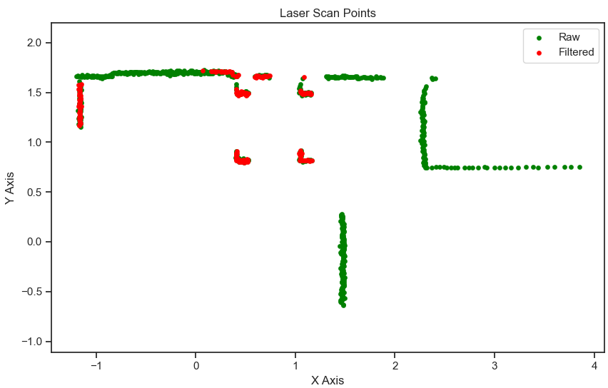

#### Clustering

The clustering, processes filtered laser scan data to identify clusters of nearby points and publishes the central positions (centroids) of these clusters, below is the analysis of multiple algorithms tested.

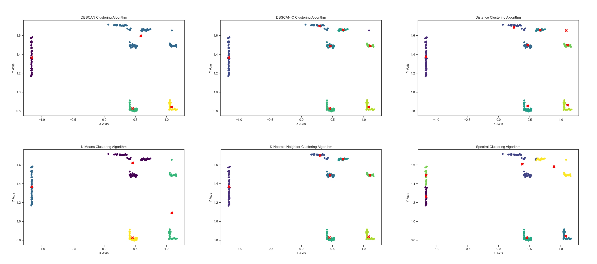

| Algorithm | Observation                                                                                                                                                                                               |
| :-------: | :-------------------------------------------------------------------------------------------------------------------------------------------------------------------------------------------------------- |
|  DBSCAN   | The algorithm requires careful tuning of parameters such as `min_samples` and `eps`, it can identify clusters of varying shapes and sizes but is computationally intensive.                               |
| DBSCAN-C  | This custom algorithm is computationally efficient and faster than standard DBSCAN, however, it struggles to detect clusters that are isolated or have varying densities.                                 |
| Distance  | Distance algorithm is computationally inexpensive and works well across various scenarios, it is straight forward to implement and does not require extensive parameter tuning.                           |
|  K-Mean   | The algorithm requires the number of clusters to be predefined parameter `n_clusters`, which may not always be practical. It is also susceptible to outliers and produces inaccurate cluster assignments. |
|    KNN    | Adapted KNN calculates centroids accurately and effectively, however, it removes any clusters with fewer points than the defined `K` value, potentially missing smaller but significant clusters.         |
| Spectral  | Struggles to find correct centroids and it requires a predefined parameter `n_clusters`, which may not be known in advance, and is computationally demanding.                                             |

**Note:** After assessing multiple clustering algorithms, *distance based clustering* was selected due to its accuracy and computationally inexpensive nature.

#### Detection

The detection system, iterates over combinations of centroid points to identify potential polygon shapes. The system uses a multi-step process to identify valid polygons (triangles or quadrilaterals) by validating distances and angles between centroid points. Once a valid shape is found, it calculates the centroid, sorts points, and determines midpoints.

The detection system performs three major checks to determine if shape is a valid polygon and represents table.

- **Exteriority**: Validates that no other centroid lies inside the candidate polygon using a ray-casting algorithm.
- **Distance Validation**: Ensures the distances between polygon points fall within predefined min and max thresholds.
- **Angle Validation**: Checks that the angles between points approximate the expected angles for the shape.

The sample shown below contains, three valid (shown in green) and three invalid (shown in red) polygon points combinations.

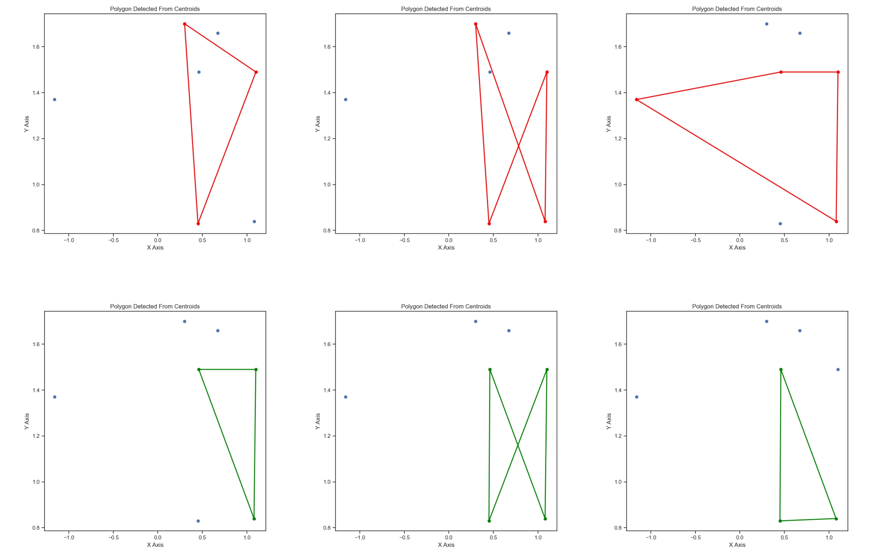

Some other polygon points combinations and shape generated:

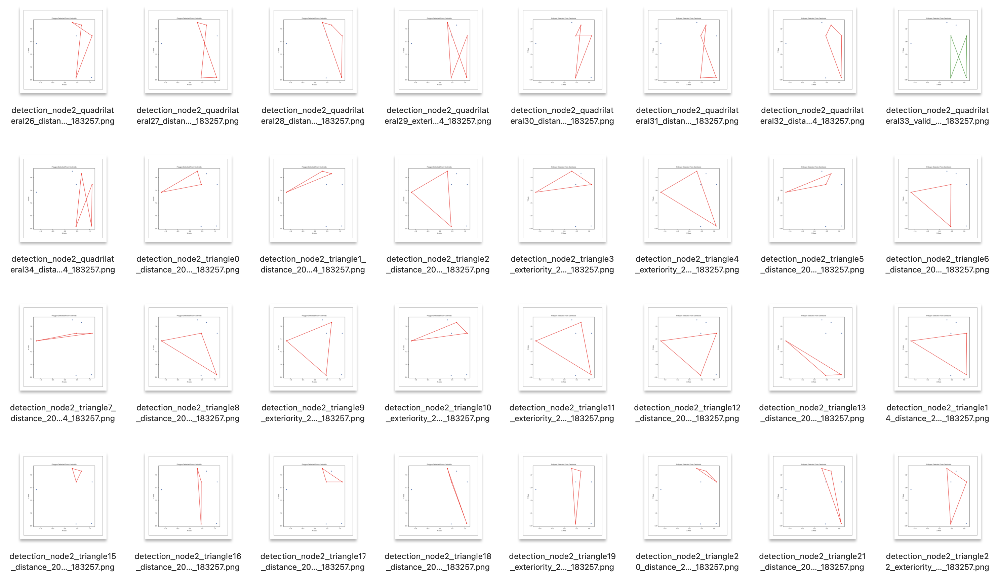

Calculation of table `centroid` and `midpoints` based on shape detected:

- **Triangle**: For triangles, the centroid is the midpoint of the hypotenuse, and midpoints are calculated for the other sides.
- **Quadrilateral**: For quadrilaterals, the centroid is the average of the points, and midpoints are calculated for all edges.

#### External Point

The external point is point on map outside table, based on robot current position, table `centroid` and `midpoints` which help the robot to align with table before performing dock.

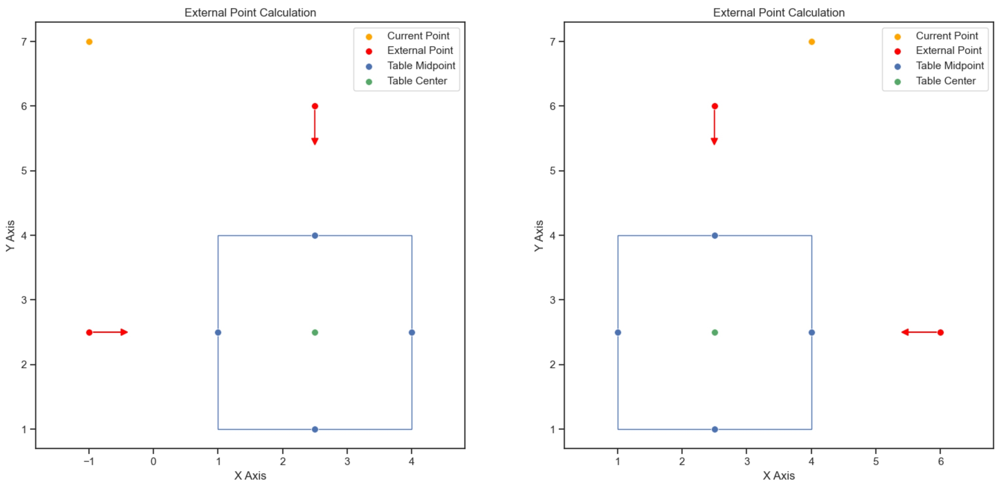

## Roadmap

- [x] Task 1 : Set up the Nav2 system in order to control the robot.
- [x] Task 2 : Develop a system to detect the trash table based on the table's legs separation.
- [x] Task 3 : Implement a control mechanism for the robot to navigate underneath the table and pick up the table.
- [x] Task 4 : Design a system to command the robot to drop and reverse out from under the trash table.
- [x] Task 5 : Develop a web application to control the entire process and containerize the project.
- [x] Task 6 : Create comprehensive documentation for the project.

## Known Issue

See the [open issues](https://github.com/llabhishekll/cafeteriabot_project/issues) for a full list of proposed features (and known issues).

#### Localization (AMCL)

The Adaptive Monte Carlo Localization (AMCL) algorithm is widely used in robotics for localizing a robot within a map, however, AMCL can sometimes provide poor localization accuracy, which can cause the entire detection system to suffer, resulting in incorrect identification of table positions or centroids.

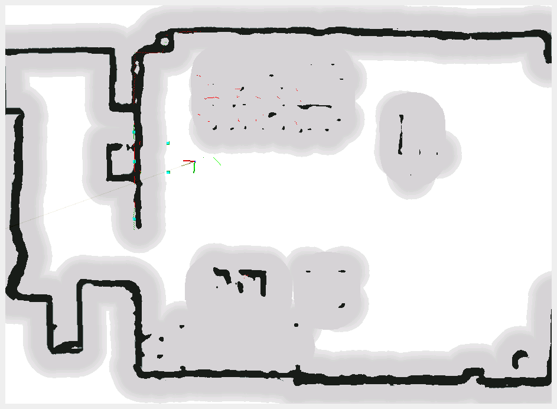

#### Table Near Wall

When a table is placed near a wall, the detection system might only identify part of the table legs instead of the complete table. While this partial detection does not impact performance, it reduces the number of options available for the robot to align with the table centroid.

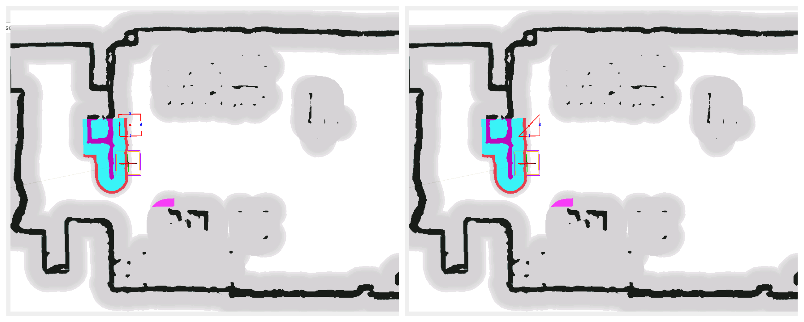

## Tools

System tool/modules used for project development.

- `Applications` : [vs-code](https://code.visualstudio.com/), [ros-extensions](https://marketplace.visualstudio.com/items?itemName=ms-iot.vscode-ros) and [docker-desktop](https://docs.docker.com/get-docker/).
- `ROS` : [ros-docker-images](https://hub.docker.com/_/ros/) (`humble`, `noetic`) or [build-source](https://www.ros.org/blog/getting-started/).

## License

Distributed under the MIT License. See `LICENSE.txt` for more information.
